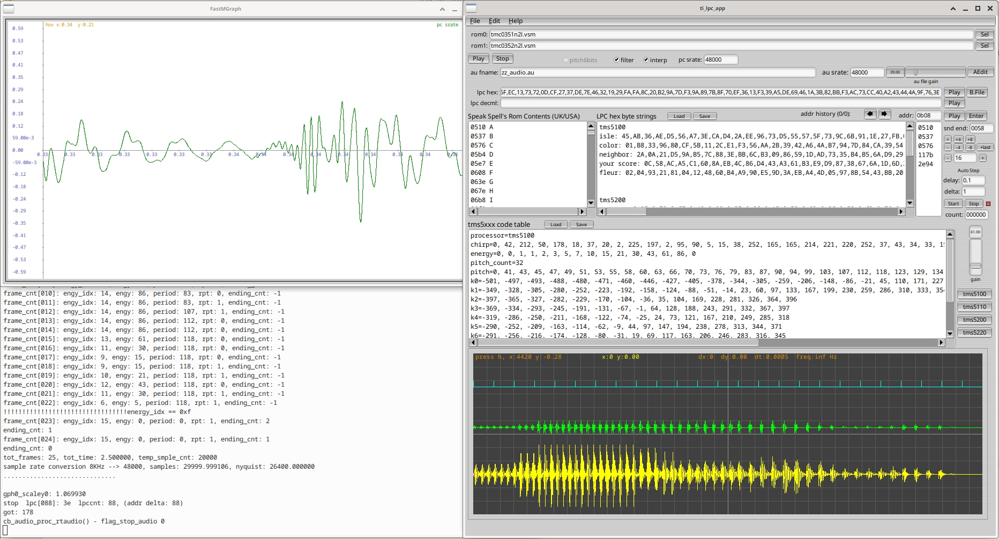

Aug-2022

## ti_lpc
Texas Instrument Speak & Spell synthesizer, renders rom sounds/vocal hex strings to PC sound hardware/sound files. 

The Speak & Spell developed in the late 1970s made use of a TMS5100 digital signal processor chip (DSP) for speech decoding. Briefly: the chip contained glottal pitch/chirp sound source(vowels), white noise source(consonants), an adjustable lattice filter and a d/a converter. Either of the 2 sound sources were fed in varying proportions to the adj lattice filter (which shaped them, the glottal source becoming formants), this then fed the d/a converter to produce analog audio. The chip was an amazing engineering achievement at that time. The speech encoding made use of linear prediction coding (lpc) which greatly reduced data rates and therefore chip count, this allowed cost effective mass production. The audio encoding was done at the factory and stored in seperate roms as bit strings. It is these rom bit strings which were read by the above mentioned chip that controlled its elements and produced fluid sound articulation. Two 16KB 8 bit roms were required to hold enough speech to make a clever useful educational tool. The bit strings which I call lpc strings below (hex byte strings), are segmented into frames, they contain which audio source to use, its period (pitch if a glottal source), amplitude gain, and filter coefficients.

The TMS5100 evolved over the next few years with improvements in speech quality, e.g: TMS5200, TMS5220. Some difference are the glottal waveform shape and code lookup tables used for filter coefficients among other things. These changes make for incompatability, so vocal rom strings for one version of chip won't work well or at all with other versions. This app has tables for 3 chip numbers mentioned, so try all 3 for best sound. You can also make changes to the tables for other chip versions not included.

The code was developed with gcc on Ubuntu 18.04 64 bit, it has 'pulseaudio' and 'jack' dependency for linux, and requires the FLTK library also. Code will compile on Windows with msys/mingw and seems to run, but I was only able to test (for Windows) using VirtualBox which is quite clunky as this app has a 2nd thread for realtime audio in addition to the gui thread.

Some of the code is re-purposed from other projects I've tinkered with over the years, so excuse the antiquated c style, evolving conventions and inefficiencies.
Also note the code is not precise in sound reproduction to the hardware, but it sounds close enough.

Portions of this code come from the 'Speech library for Arduino' project:  https://github.com/going-digital/Talkie,
You will find many lpc strings in that project to try, they are within c code files, but this app will accept cut/pasted versions of them, just copy the hex strings and comma delimiters, remove array names, equal signs, braces and semicolons.

See also: http://furrtek.free.fr/index.php?a=speakandspell&ss=9&i=2

The app makes use of information from MAME project and the toil of numerous archivists(hackers), visit the mame site to see some amazing preservation coding.

Where peices of code or ideas are originated from other people, the comments in source code will give links to who or where it came from.


** I've not looked at this code for a number of years now, but it still compiles without problems on Ubuntu 20.04.


## Build
Tested with gnu gcc, for windows it compiles with msys/mingw. 
Requires: pulseaudio(linux), jack(linux), and FLTK libraries for linking, fltk-1.3.4-2 or better should work.

To build, type: make

No installation is required.

If it built without error, then run: './ti_lpc' or 'ti_lpc.exe' from a folder where permissions for execution have been enabled, the app will read/create a 'ti_lpc.ini' settings file, and two '.au' audio files in same folder.


## Usage
Hover over controls to see a hint at what they do.

Place Speak & Spell unzipped roms in a dir (optional, see below). Get them from a MAME rom site, e.g: snspell.zip. Then select their dir path with the 2 'Sel' buttons.

Speak & Spell roms come in pairs, e.g: 

USA rom0 file: tmc0351n2l.vsm 
USA rom1 file: tmc0352n2l.vsm

UK rom0 file: cd2303.vsm					//quick way to to hear difference is sounding the Z letter, Zed of UK, Zee for USA
UK rom1 file: cd2304.vsm

(Roms are optional, if you have hex/decimal speech strings you can use them as is without roms).


Quick note: the 3 buttons on the right labelled: 'tms5100', 'tms5200', 'tms5220', each load predefined code tables into editbox 'tms5xxx code tables', try each of these if speech is corrupted or the wrong pitch, after you've read below.


The left editbox 'Rom Contents' will show all the letters, numbers phrases, beeps and words in the selected rom pair, and their rom hex address (only for Speak & Spell roms as these roms have a certain format and contain text that was shown on the unit's fluorescent display). The rom address itself needs to be right clicked on to make it sound (not the letter or word/sentence). 

The larger middle editbox 'LPC hex byte strings' holds handy scratch area for lpc hex byte strings (one hex string per line, use a colon if you want to prefix a text label, e.g: 'isle: 45,AB,36,....', 8 bit only, it can handle c code formatting e.g: 0x45,0xab.. is ok, these likewise can be right clicked to sound. Notice whenever you sound, the edit boxes 'lpc hex' has a hex string place in it. This is the last sounded string (possibly extracted from a rom depending on what editbox you right clicked it), you can play it again by hitting the Play button to the right, there is also the editbox 'lpc decml' which allows decimal strings to be entered, its also filled in when you click the Play for 'lpc hex' and visa versa.  

Speech roms exist for devices other than the Speak & Spell, these roms would still sound, but you will need the rom addresses where each vocal string resides.
You can enter rom address in the 'addr' edit box and hit enter. There is also some buttons to shift an address by a fixed amounts to help explore and find lpc string locations, if you don't know their addresses. You'll have to select which TMS chip version the roms are coded for using the 3 buttons on right, e.g: 'tms5200'.

The app also generates a: 'zz_audio.au' sound file after each sounding, the filename, samplerate and gain can be changed as req. Also generated is a: 'zz_cummulative.au' sound file, always at 8KHz, it has all the soundings made since starting the app session.

The embedded graph shows various waveforms, cyan trace marks start of each speech frame, yellow is rendered speech wfm (lattice filter o/p, 8KHz), green is glottal pitch/white noise stimulus that feeds into lattice filter.

The second graph in its own window shows the samplerate converted speech wfm, this is at the samplerate you have entered for your current PC audio hardware.

Note: if you set an incorrect 'pc srate' (i.e: not matching your current pc's audio hardware samplerate) you will get pitch and duration errors (chipmunk/slo-mo).

Long strings of speech (>20 secs of voicing) will take some time to render and be heard due to unoptimized samplerate conversion, it may appear the app has locked up, but if you ran app from a command line you will see its probably still processing audio by the console output.

Use 'AEdit' button to open your favourite audio editor, it runs a script/bat file and passes the saved .au audio filename you specified (or 'zz_audio.au'), edit the script or batch to call whatever audio app you prefer:
Linux script: 'open_audio_editor.sh'
Win batch: 'open_audio_editor.bat'


You can use a (antique) program called: QBoxPro (with DosBox running Windows 3.11) to create a tms5220 lpc compatible a binary file from a wave file. For an excellent guide, refer: http://furrtek.free.fr/index.php?a=speakandspell&ss=9&i=2

Select a binary file to play using 'B.File' button.


## embedded graph

leftclick and drag to move trace on x-axis
select a sample on a trace firstly (this also gives you keybrd focus),

use mousewheel to change x scale.

press 'c' to zero y offset positions.

press 'a' and spin mousewheel to change y amplitude, on a per trace basis

press 'x' and spin mousewheel to change x position (or just drag), for all traces 
press 'y' and spin mousewheel to change y position, on a per trace basis


##### Play 'zz_audio.au' audio file to hear what this code produces.

```
(linux)   edit the .sh script to call your favourite text editor: open_editor.sh  (maybe: gedit)
(windows) edit the .bat file to call your favourite text editor: open_editor.bat  (poss: notepad)

e.g: for tms5100
isle:45,AB,36,AE,D5,56,A7,3E,CA,D4,2A,EE,96,73,D5,55,57,5F,73,9C,6B,91,1E,27,FB,04,9F,34,A3,C6,CE,89,29,9A,A5,5F,EC,13,73,72,0D,CF,27,37,DE,7E,46,32,19,29,FA,FA,8C,20,B2,9A,7D,F3,9A,89,7B,8F,70,EF,36,13,F3,39,A5,DE,69,46,1A,3B,82,BB,F3,AC,73,CC,40,A2,43,44,4A,9F,76,3E,00,00,95 45,AB,36,AE,D5,56,A7,3E,CA,D4,2A,EE,96,73,D5,55,57,5F,73,9C,6B,91,1E,27,FB,04,9F,34,A3,C6,CE,89,29,9A,A5,5F,EC,13,73,72,0D,CF,27,37,DE,7E,46,32,19,29,FA,FA,8C,20,B2,9A,7D,F3,9A,89,7B,8F,70,EF,36,13,F3,39,A5,DE,69,46,1A,3B,82,BB,F3,AC,73,CC,40,A2,43,44,4A,9F,76,3E


//some strings for different chips, place them in 'LPC byte strings' editbox, anything before the colon such as labels (as shown below) are removed on playing the string (play by right clicking on a line)


tms5100
isle:45,AB,36,AE,D5,56,A7,3E,CA,D4,2A,EE,96,73,D5,55,57,5F,73,9C,6B,91,1E,27,FB,04,9F,34,A3,C6,CE,89,29,9A,A5,5F,EC,13,73,72,0D,CF,27,37,DE,7E,46,32,19,29,FA,FA,8C,20,B2,9A,7D,F3,9A,89,7B,8F,70,EF,36,13,F3,39,A5,DE,69,46,1A,3B,82,BB,F3,AC,73,CC,40,A2,43,44,4A,9F,76,3E,00,00,95 45,AB,36,AE,D5,56,A7,3E,CA,D4,2A,EE,96,73,D5,55,57,5F,73,9C,6B,91,1E,27,FB,04,9F,34,A3,C6,CE,89,29,9A,A5,5F,EC,13,73,72,0D,CF,27,37,DE,7E,46,32,19,29,FA,FA,8C,20,B2,9A,7D,F3,9A,89,7B,8F,70,EF,36,13,F3,39,A5,DE,69,46,1A,3B,82,BB,F3,AC,73,CC,40,A2,43,44,4A,9F,76,3E
color :01,B8,33,96,80,CF,5B,11,2C,E1,F3,56,AA,2B,39,42,A6,4A,B7,94,7D,84,CA,39,54,5D,E7,CA,A5,64,AF,A2,EC,34,C3,4A,57,2B,DC,71,47,54,36,C7,A0,6A,9F,AC,6A,99,E6,C4,3A,C5,F8,36,A9,6A,78,BA,B5,65,D2,95,F1,F6,31,DC,15,5D,C9,45,73,EC,39,67,5F,7E,E9,F5,88,12,0B,44,B5,19 
neighbor: 2A,0A,21,D5,9A,B5,7C,88,3E,BB,6C,B3,09,86,59,1D,AD,73,35,B4,B5,6A,D9,29,F4,AA,A5,9C,24,9B,0E,41,57,6D,BD,B4,D3,A8,33,69,78,EA,6E,44,E0,34,A3,24,B3,B2,A4,3A,C5,5A,74,E4,25,86,9E,5A,B6,97,6D,CC,D6,CC,D2,4B,EB,F6,B1,B5,5B,9F,3A,EB,AA,37,DF,B4,DD,0B,C9,94,6E,EA,BA,67,5A,29,6B,1E
your score: 0C,58,AC,A5,C1,60,8A,EB,4C,86,D4,43,A3,61,B3,E9,D9,87,38,67,6A,1D,6D,2E,3E,C8,06,57,5D,6B,B2,90,8E,66,FA,92,76,60,33,C4,6C,25,ED,22,6E,AB,73,4A,BE,43,43,B4,A0,88,A6,87,25,EB,26,91,8B,0F,CF,C6,D4,2C,6F,5D,31,44,C4,EA,D9,59,73,88,55,5C,D0,CA,5B,02,73,B5,27,30,FA,B8,07,43,6B,EF,1A,6D,6D,9B,91,C3,35,43,BA,2C,A3,63,9A,37,A7,D9,B6,BB,E6,9C,74,77,CB,58,01,8C,51,11,C0,79,15,09,CC,D7,19,01,06,02,04,37,D3,BC,96,15,16,EA,B7,45,BE,DD,5D,AA,51,2B,7C,66,98,66,A7,D6,95,EE,09,55,7F,6D,88,3C,69,66,79,EA,E8,A3,4D,DD,4A,CB,AC,6F,5A,BA,B9,4E,DB,5E,BF,F4,42,20,8C,56,04,5C,33,C5,E0,01


tms5200
correct: 0x0E,0x70,0xC7,0x49,0x00,0x3E,0x86,0xA5,0x58,0x8D,0x2C,0x53,0xCD,0x76,0x8B,0x56,0x98,0x23,0x95,0xA2,0x99,0x6B,0x95,0x9B,0xDA,0xAC,0xCA,0x27,0x6D,0xF1,0x8D,0xBD,0xAB,0x59,0xF7,0x26,0xB5,0xBE,0x73,0x79,0x4D,0x90,0xDC,0xB9,0x21,0x0C,0x28,0x8F,0x91,0x29,0x47,0x00,0x00,0x01,0x0C,0xED,0xAA,0x80,0xE5,0xA2,0x05,0xD0,0x74,0x3B,0x02,0xBC,0x4B,0x7A,0x00,0x00
what's that: 0x00,0xA9,0x62,0xAD,0x1F,0x38,0x3A,0x9F,0x4A,0x87,0x7C,0x12,0x6D,0x73,0x2A,0xE7,0xE3,0x4D,0x3D,0xF5,0x29,0x6C,0xCF,0x64,0xAF,0xC4,0x37,0x6F,0x55,0xD0,0x69,0x92,0xEA,0x24,0x00,0x59,0x85,0x1B,0x20,0x84,0x34,0x06,0xF8,0xEC,0x82,0x00,0xED,0xCC,0x52,0xC1,0x6A,0x46,0x6A,0x26,0x3E,0x75,0x54,0x99,0x62,0xD2,0x7D,0x34,0x45,0x44,0xB1,0x72,0x7E,0x07,0x68,0x5C,0xE3,0x00,0x0F,0x6C,0x0D,0x50,0x00,0x19,0x01,0x34,0x71,0x76,0x45,0x8B,0x13,0x66,0x22,0x77,0x54,0xDE,0xBB,0xAB,0xF2,0xEA,0x53,0xF9,0x10,0x61,0x6A,0x6F,0x4E,0xE5,0x9A,0x87,0xC6,0x4C,0x39,0x45,0x8C,0x65,0x66,0xFE,0x78,0x65,0x3E,0xA7,0x7A,0x44,0xE9,0x95,0x85,0x5C,0xEA,0x1E,0x95,0x47,0x11,0x4B,0x99,0x69,0x4C,0x01,0x07,0x0C,0x13,0xA1,0x81,0x07,0x00,0x00
ready start: 0xAE,0x91,0x85,0xD3,0x32,0xB8,0xB5,0xC6,0x35,0x4E,0x09,0xCA,0x7E,0x6A,0xDF,0xB9,0xCC,0xB4,0xFB,0xA9,0xE2,0xD4,0x30,0xD5,0xEE,0xB7,0x5A,0x55,0xEA,0x5A,0x10,0x99,0xA5,0x55,0x31,0x1B,0x1B,0x4E,0xA6,0x55,0xE5,0xAE,0xCA,0xD2,0x9D,0x5A,0x55,0xA6,0x08,0x49,0x2D,0x8D,0xB5,0x6C,0x11,0xB0,0x54,0x9A,0x06,0x0C,0xB0,0x8C,0x45,0x29,0xBC,0x4A,0x53,0xCB,0x4E,0xA5,0xA9,0xC2,0x4C,0xD5,0xF2,0x1A,0xA0,0x03,0x35,0x05,0xFC,0xA9,0x6C,0x01,0x05,0xFC,0x1D,0x0C,0x10,0x80,0xA6,0xD2,0x4F,0x1E,0x43,0x44,0x86,0xB4,0xBD,0xC5,0xAD,0x4E,0xE5,0x8B,0x77,0x18,0x37,0x59,0x85,0x9F,0xE6,0xA5,0xBA,0x78,0x67,0x33,0x6D,0x91,0x9F,0x22,0x1D,0xE6,0xD0,0x45,0xDA,0x49,0x46,0xB8,0x2C,0x00,0x03,0x64,0x19,0xCA,0x80,0x26,x9B,0x11,0xE0,0x12,0x33,0x00,0xC0,0x03,0x00,0x00
cassette: 0x0E,0xF0,0x25,0x48,0x03,0x1A,0x68,0xB9,0x49,0xCD,0xE1,0x1D,0xAB,0x56,0x06,0x58,0xD6,0xCD,0x02,0x16,0x70,0xC0,0xB7,0x19,0x16,0x90,0x40,0xAB,0xDC,0x30,0xF7,0xE8,0xBA,0xBB,0xDE,0xF5,0x6C,0x46,0xED,0x9A,0x85,0x79,0xC7,0xA9,0x95,0xAC,0x40,0x03,0x1E,0x20,0x80,0x54,0xA9,0x18,0x78


tms5220
automatic: 6B,AC,A4,A7,82,FD,DD,F1,0E,67,68,B2,A2,83,72,1B,A0,52,65,03,FC,24,3A,EA,AD,CD,D5,4C,DB,A9,AB,76,4B,93,2D,67,28,A2,CC,C2,F3,8C,21,2B,D7,70,C9,D8,86,4A,8D,C6,35,49,E9,8B,54,29,76,37,63,C8,CE,DD,54,6A,9D,BA,C6,D2,D2,58,72,AB,5B,DE,72,35,35,5B,84,54,6D,D3,EE,90,11,EA,4E,5A,5B,53,AA,B3,2F,B9,D3,59,BB,6B,E5,94,35,7B,6F,E7,34,AD,D8,BA,17,81,22,94,BB,88,6C,00,03,B4,12,22,01,0E,FC,3F,62,13,7E,23,4C,22
inspector: 29,EB,5E,D9,32,27,9D,6E,FA,66,17,59,7D,DB,DB,B4,B6,7B,D0,CC,70,D2,DB,D6,0D,C7,38,AC,4D,D2,F0,0D,B3,A9,BB,73,C0,4F,E9,11,F0,80,02,86,52,01,03,44,EA,7A,A2,1A,43,D3,6C,F3,4D,6F,DA,B2,56,0C,82,AD,31,29,44,28,77,11,D9,00,E0,80,ED,3C,46,5F,EB,A0,B4,F8,2D,53,F5,27,B0,EC,3F,6F,69,2F,B1,50,4E,F2,86,B3,86,13,18,F5,17,DF,F0,96,65,58,C9,59,FC,F7,FF,6E,8A,42,6C,D5,9A

afternoon: 0xC7,0xCE,0xCE,0x3A,0xCB,0x58,0x1F,0x3B,0x07,0x9D,0x28,0x71,0xB4,0xAC,0x9C,0x74,0x5A,0x42,0x55,0x33,0xB2,0x93,0x0A,0x09,0xD4,0xC5,0x9A,0xD6,0x44,0x45,0xE3,0x38,0x60,0x9A,0x32,0x05,0xF4,0x18,0x01,0x09,0xD8,0xA9,0xC2,0x00,0x5E,0xCA,0x24,0xD5,0x5B,0x9D,0x4A,0x95,0xEA,0x34,0xEE,0x63,0x92,0x5C,0x4D,0xD0,0xA4,0xEE,0x58,0x0C,0xB9,0x4D,0xCD,0x42,0xA2,0x3A,0x24,0x37,0x25,0x8A,0xA8,0x8E,0xA0,0x53,0xE4,0x28,0x23,0x26,0x13,0x72,0x91,0xA2,0x76,0xBB,0x72,0x38,0x45,0x0A,0x46,0x63,0xCA,0x69,0x27,0x39,0x58,0xB1,0x8D,0x60,0x1C,0x34,0x1B,0x34,0xC3,0x55,0x8E,0x73,0x45,0x2D,0x4F,0x4A,0x3A,0x26,0x10,0xA1,0xCA,0x2D,0xE9,0x98,0x24,0x0A,0x1E,0x6D,0x97,0x29,0xD2,0xCC,0x71,0xA2,0xDC,0x86,0xC8,0x12,0xA7,0x8E,0x08,0x85,0x22,0x8D,0x9C,0x43,0xA7,0x12,0xB2,0x2E,0x50,0x09,0xEF,0x51,0xC5,0xBA,0x28,0x58,0xAD,0xDB,0xE1,0xFF,0x030xC7,0xCE,0xCE,0x3A,0xCB,0x58,0x1F,0x3B,0x07,0x9D,0x28,0x71,0xB4,0xAC,0x9C,0x74,0x5A,0x42,0x55,0x33,0xB2,0x93,0x0A,0x09,0xD4,0xC5,0x9A,0xD6,0x44,0x45,0xE3,0x38,0x60,0x9A,0x32,0x05,0xF4,0x18,0x01,0x09,0xD8,0xA9,0xC2,0x00,0x5E,0xCA,0x24,0xD5,0x5B,0x9D,0x4A,0x95,0xEA,0x34,0xEE,0x63,0x92,0x5C,0x4D,0xD0,0xA4,0xEE,0x58,0x0C,0xB9,0x4D,0xCD,0x42,0xA2,0x3A,0x24,0x37,0x25,0x8A,0xA8,0x8E,0xA0,0x53,0xE4,0x28,0x23,0x26,0x13,0x72,0x91,0xA2,0x76,0xBB,0x72,0x38,0x45,0x0A,0x46,0x63,0xCA,0x69,0x27,0x39,0x58,0xB1,0x8D,0x60,0x1C,0x34,0x1B,0x34,0xC3,0x55,0x8E,0x73,0x45,0x2D,0x4F,0x4A,0x3A,0x26,0x10,0xA1,0xCA,0x2D,0xE9,0x98,0x24,0x0A,0x1E,0x6D,0x97,0x29,0xD2,0xCC,0x71,0xA2,0xDC,0x86,0xC8,0x12,0xA7,0x8E,0x08,0x85,0x22,0x8D,0x9C,0x43,0xA7,0x12,0xB2,0x2E,0x50,0x09,0xEF,0x51,0xC5,0xBA,0x28,0x58,0xAD,0xDB,0xE1,0xFF,0x03
twenty: 0x01,0x98,0xD1,0xC2,0x00,0xCD,0xA4,0x32,0x20,0x79,0x13,0x04,0x28,0xE7,0x92,0xDC,0x70,0xCC,0x5D,0xDB,0x76,0xF3,0xD2,0x32,0x0B,0x0B,0x5B,0xC3,0x2B,0xCD,0xD4,0xDD,0x23,0x35,0xAF,0x44,0xE1,0xF0,0xB0,0x6D,0x3C,0xA9,0xAD,0x3D,0x35,0x0E,0xF1,0x0C,0x8B,0x28,0xF7,0x34,0x01,0x68,0x22,0xCD,0x00,0xC7,0xA4,0x04,0xBB,0x32,0xD6,0xAC,0x56,0x9C,0xDC,0xCA,0x28,0x66,0x53,0x51,0x70,0x2B,0xA5,0xBC,0x0D,0x9A,0xC1,0xEB,0x14,0x73,0x37,0x29,0x19,0xAF,0x33,0x8C,0x3B,0xA7,0x24,0xBC,0x42,0xB0,0xB7,0x59,0x09,0x09,0x3C,0x96,0xE9,0xF4,0x58,0xFF,0x0F0x01,0x98,0xD1,0xC2,0x00,0xCD,0xA4,0x32,0x20,0x79,0x13,0x04,0x28,0xE7,0x92,0xDC,0x70,0xCC,0x5D,0xDB,0x76,0xF3,0xD2,0x32,0x0B,0x0B,0x5B,0xC3,0x2B,0xCD,0xD4,0xDD,0x23,0x35,0xAF,0x44,0xE1,0xF0,0xB0,0x6D,0x3C,0xA9,0xAD,0x3D,0x35,0x0E,0xF1,0x0C,0x8B,0x28,0xF7,0x34,0x01,0x68,0x22,0xCD,0x00,0xC7,0xA4,0x04,0xBB,0x32,0xD6,0xAC,0x56,0x9C,0xDC,0xCA,0x28,0x66,0x53,0x51,0x70,0x2B,0xA5,0xBC,0x0D,0x9A,0xC1,0xEB,0x14,0x73,0x37,0x29,0x19,0xAF,0x33,0x8C,0x3B,0xA7,0x24,0xBC,0x42,0xB0,0xB7,0x59,0x09,0x09,0x3C,0x96,0xE9,0xF4,0x58,0xFF,0x0F

(lpc gen by QBoxPro)
kilo pictures: 30,9A,E4,A3,34,B2,CA,69,9A,D6,4E,D3,36,A7,6B,46,27,D8,DB,9C,A1,68,9B,60,6F,73,FA,22,6D,53,B4,CD,19,A2,CA,75,D6,35,67,08,B2,36,94,9B,8C,C1,9B,1E,15,A9,3B,06,AB,66,CC,38,4E,1B,8D,9E,09,95,C8,63,B4,A6,27,94,E3,8E,C1,DA,9A,54,4A,72,7A,EF,B2,53,A9,CD,E9,7D,F0,4A,E3,CE,A7,8B,59,33,D1,FA,9C,26,65,AE,60,DB,7C,9A,58,38,53,62,F3,69,52,C1,4A,8D,4D,A7,CA,05,2B,B5,56,9F,2A,57,EC,D0,5E,7D,AA,5C,B0,DD,6B,F1,29,4B,C3,72,EF,45,A7,AC,03,43,35,17,9F,B2,56,34,F3,58,9C,DC,12,D9,2C,B3,C9,28,87,63,67,8B,3A,AB,2A,96,4D,66,EA,AC,AA,78,11,E9,8D,3B,BA,62,9D,B4,66,4A,1B,32,4E,F7,AE,49,06,28,20,C7,00,57,89,3A,E0,18,09,07,54,9E,36,FA,2C,C3,23,B8,69,EB,BD,ED,30,D7,C6,AD,B7,AE,D3,83,5A,8F,CE,A5,8C,70,EE,BC,BA,90,2D,43,F5,F5,E9,53,E4,6A,D5,D5,A7,CF,91,B2,C3,1E,9F,3E,05,B5,A8,5C,72,FA,62,CC,2D,7A,6E,E9,B3,4A,B5,CC,3A,0C,08,D6,42,00,49,69,3A,20,5A,CD,33,F4,A0,A9,54,73,4F,5F,9D,26,CB,CC,2D,63,B2,1A,92,5B,25,8C,45,9B,AB,47,9D,30,76,A3,A6,E6,4D,04,D0,BC,AA,01,92,D6,38,4D,0B,56,AC,55,F7,74,2D,78,93,75,DD,D3,17,E7,25,39,51,CF,90,4D,B4,7B,D7,39,43,31,DE,62,53,FB,F4,D9,75,A8,77,DD,D3,67,55,65,5A,73,4E,9F,74,95,69,D7,3D,5D,B2,63,EA,3D,E5,F4,59,66,9A,54,DD,D1,0F,9C,A9,EA,4D,14,50,60,85,02,26,B6,18,DD,64,61,6E,5E,65,75,49,65,88,77,94,D1,25,19,21,DA,56,DB,90,84,A5,78,3A,2D,43,14,5A,12,E1,34,F5,4E,44,B9,47,EC,30,78,9E,99,69,71,DD,12,A9,56,86,C5,05,18,C9,F4,E5,1C,D6,64,24,2D,A8,4A,D4,DC,53,F7,A2,C6,96,F7,4E,D3,2A,99,56,CF,3D,4D,2B,68,9E,33,A5,8C,AD,A1,6A,F4,1C,06,38,23,25,80,22,39,1C,30,93,8A,03,D6,9A,08,C0,DC,53,01,98,BB,22,00,63,AA,1A,A0,37,F6,33,B5,46,66,D6,4B,CF,5C,33,46,46,2F,6E,73,0A,94,5D,3D,A9,CD,B5,B0,9A,46,93,36,97,40,11,D1,4B,DA,5C,1D,9B,56,D5,29,73,93,12,5A,3D,47,01,15,6A,28,E0,2B,52,05,7C,A7,22,80,AB,8C,05,70,8C,89,00,8E,30,13,C0,12,A6,04,E8,C2,ED,01


//some TMS5xxx code tables

chirp=0, 42, 212, 50, 178, 18, 37, 20, 2, 225, 197, 2, 95, 90, 5, 15, 38, 252, 165, 165, 214, 221, 220, 252, 37, 43, 34, 33, 15, 255, 248, 238, 237, 239, 247, 246, 250, 0, 3, 2, 1, 0, 0, 0, 0, 0, 0, 0, 0, 0
energy=0, 0, 1, 1, 2, 3, 5, 7, 10, 15, 21, 30, 43, 61, 86, 0
pitch_count=32
pitch=0, 41, 43, 45, 47, 49, 51, 53, 55, 58, 60, 63, 66, 70, 73, 76, 79, 83, 87, 90, 94, 99, 103, 107, 112, 118, 123, 129, 134, 140, 147, 153
k0=-501, -497, -493, -488, -480, -471, -460, -446, -427, -405, -378, -344, -305, -259, -206, -148, -86, -21, 45, 110, 171, 227, 277, 320, 357, 388, 413, 434, 451, 464, 474, 498
k1=-349, -328, -305, -280, -252, -223, -192, -158, -124, -88, -51, -14, 23, 60, 97, 133, 167, 199, 230, 259, 286, 310, 333, 354, 372, 389, 404, 417, 429, 439, 449, 506
k2=-397, -365, -327, -282, -229, -170, -104, -36, 35, 104, 169, 228, 281, 326, 364, 396
k3=-369, -334, -293, -245, -191, -131, -67, -1, 64, 128, 188, 243, 291, 332, 367, 397
k4=-319, -286, -250, -211, -168, -122, -74, -25, 24, 73, 121, 167, 210, 249, 285, 318
k5=-290, -252, -209, -163, -114, -62, -9, 44, 97, 147, 194, 238, 278, 313, 344, 371
k6=-291, -256, -216, -174, -128, -80, -31, 19, 69, 117, 163, 206, 246, 283, 316, 345
k7=-218, -133, -38, 59, 152, 235, 305, 361
k8=-226, -157, -82, -3, 76, 151, 220, 280
k9=-179, -122, -61, 1, 62, 123, 179, 231


chirp_hx=0x00, 0x03, 0x0f, 0x28, 0x4c, 0x6c, 0x71, 0x50, 0x25, 0x26, 0x4c, 0x44, 0x1a, 0x32, 0x3b, 0x13, 0x37, 0x1a, 0x25, 0x1f, 0x1d, 0x00, 0x00, 0x00, 0x00, 0x00, 0x00, 0x00, 0x00, 0x00, 0x00, 0x00, 0x00, 0x00, 0x00, 0x00, 0x00, 0x00, 0x00, 0x00, 0x00, 0x00, 0x00, 0x00, 0x00, 0x00, 0x00, 0x00, 0x00, 0x00, 0x00, 0x00
energy=0,  1,  2,  3,  4,  6,  8, 11, 16, 23, 33, 47, 63, 85, 114, 0
pitch_count=64
pitch=0, 14, 15, 16, 17, 18, 19, 20, 21, 22, 23, 24, 25, 26, 27, 28, 29, 30, 31, 32, 34, 36, 38, 40, 41, 43, 45, 48, 49, 51, 54, 55, 57, 60, 62, 64, 68, 72, 74, 76, 81, 85, 87,  90, 96, 99,103, 107, 112, 117, 122, 127, 133, 139, 145, 151, 157, 164, 171, 178, 186, 194, 202, 211
k0=-501, -498, -495, -490, -485, -478, -469, -459,-446, -431, -412, -389, -362, -331, -295, -253, -207, -156, -102, -45, 13, 70, 126, 179, 228, 272, 311, 345, 374, 399, 420, 437
k1=-376, -357, -335, -312, -286, -258, -227, -195, -161, -124, -87, -49, -10,  29,  68, 106, 143, 178, 212, 243, 272, 299, 324, 346, 366, 384, 400, 414, 427, 438, 448, 506
k2=-407, -381, -349, -311, -268, -218, -162, -102, -39, 25, 89, 149, 206, 257, 302, 341
k3=-290, -252, -209, -163, -114, -62, -9, 44, 97, 147, 194, 238, 278, 313, 344, 371
k4=-318, -283, -245, -202, -156, -107, -56, -3, 49, 101, 150, 196, 239, 278, 313, 344
k5=-193, -152, -109, -65, -20,  26, 71, 115, 158, 198, 235, 270, 301, 330, 355, 377
k6=-254, -218, -180, -140, -97, -53, -8, 36, 81, 124, 165, 204, 240, 274, 304, 332
k7=-205, -112, -10, 92, 187, 269, 336, 387
k8=-249, -183, -110, -32, 48, 126, 198, 261
k9=-190, -133, -73, -10, 53, 115, 173, 227


chirp_hx=0x00, 0x03, 0x0f, 0x28, 0x4c, 0x6c, 0x71, 0x50, 0x25, 0x26, 0x4c, 0x44, 0x1a, 0x32, 0x3b, 0x13, 0x37, 0x1a, 0x25, 0x1f, 0x1d, 0x00, 0x00, 0x00, 0x00, 0x00, 0x00, 0x00, 0x00, 0x00, 0x00, 0x00, 0x00, 0x00, 0x00, 0x00, 0x00, 0x00, 0x00, 0x00, 0x00, 0x00, 0x00, 0x00, 0x00, 0x00, 0x00, 0x00, 0x00, 0x00, 0x00, 0x00
energy=0,  1,  2,  3,  4,  6,  8, 11, 16, 23, 33, 47, 63, 85, 114, 0
pitch_count=64
pitch=0, 15, 16, 17, 18, 19, 20, 21, 22, 23, 24, 25, 26, 27, 28, 29, 30, 31, 32, 33, 34, 35, 36, 37, 38, 39, 40, 41, 42, 44, 46, 48, 50, 52, 53, 56, 58, 60, 62, 65, 68, 70, 72, 76, 78, 80, 84, 86, 91, 94, 98, 101, 105, 109, 114, 118, 122, 127, 132, 137, 142, 148, 153, 159
k0=-501, -498, -497, -495, -493, -491, -488, -482, -478, -474, -469, -464, -459, -452, -445, -437, -412, -380, -339, -288, -227, -158, -81, -1, 80, 157, 226, 287, 337, 379, 411, 436
k1=-328, -303, -274, -244, -211, -175, -138, -99, -59, -18, 24, 64, 105, 143, 180, 215, 248, 278, 306, 331, 354, 374, 392, 408, 422, 435, 445, 455, 463, 470, 476, 506
k2=-441, -387, -333, -279, -225, -171, -117, -63, -9, 45, 98, 152, 206, 260, 314, 368
k3=-328, -273, -217, -161, -106, -50, 5, 61, 116, 172, 228, 283, 339, 394, 450, 506
k4=-328, -282, -235, -189, -142, -96, -50, -3, 43, 90, 136, 182, 229, 275, 322, 368
k5=-256, -212, -168, -123, -79, -35, 10, 54, 98, 143, 187, 232, 276, 320, 365, 409
k6=-308, -260, -212, -164, -117, -69, -21, 27, 75, 122, 170, 218, 266, 314, 361, 409
k7=-256, -161, -66, 29, 124, 219, 314, 409
k8=-256, -176, -96, -15, 65, 146, 226, 307
k9=-205, -132, -59, 14, 87, 160, 234, 307
```





# Sample


<video src="https://github.com/BrerDawg/ti_lpc/blob/master/zz_aud.mp4"></video>

)


